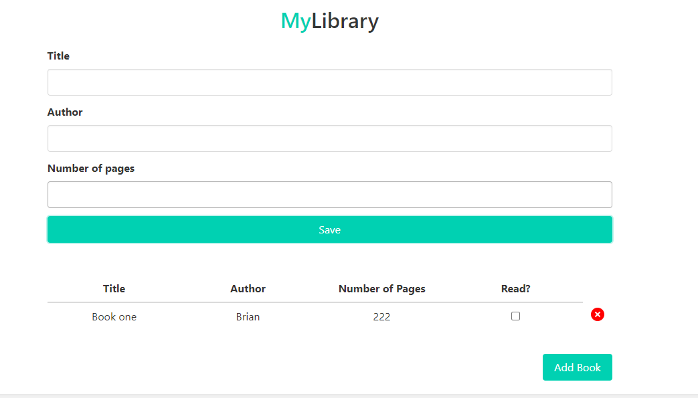
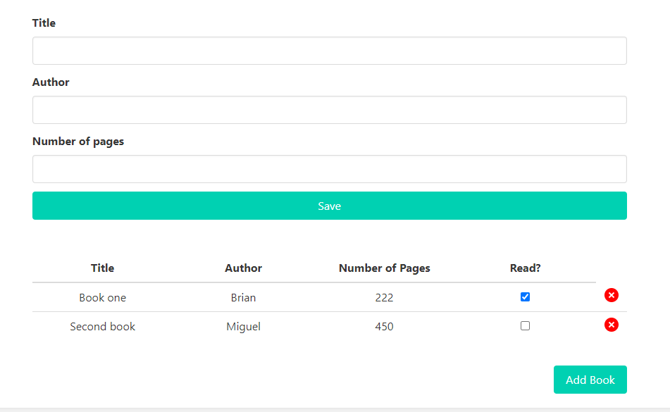
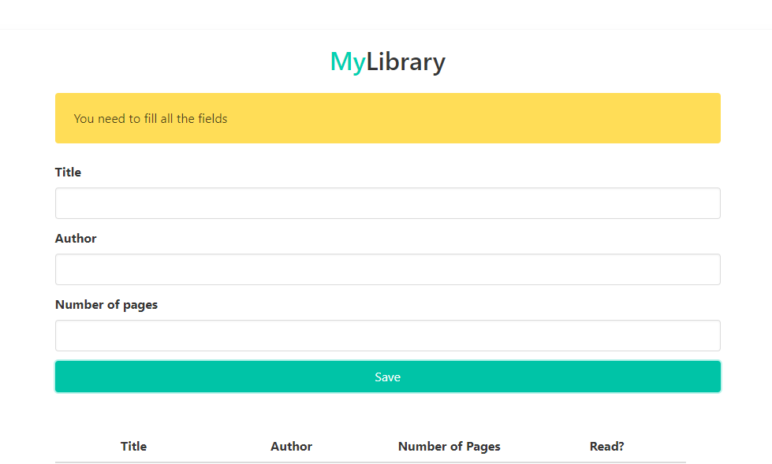

# Library

This is a project that contains a small Library app, that was created with Javascript, HTML, Bootstrap and, DOM. In this app you can store a new book, see the books that are stored, you can check if is already read or not, and you can delete it.

## Live demo

[live demo](https://briansammit.github.io/Library.github.io/)

## Built With

- JavaScript
- HTML
- Bootstrap

## How to start the project from your Local enviroment

- Open your terminal and cd where you want to store the project
- Run the following command - `git clone https://github.com/BrianSammit/Library.git`
- Cd into the directory - `cd Library`
- Open the live server on your VScode `Alt + L` then `Alt + o`

## Author

👤 **Brian Cruz**

- Github: [@githubhandle](https://github.com/BrianSammit)
- Twitter: [@twitterhandle](https://twitter.com/cruzsammit)
- Linkedin: [linkedin](https://www.linkedin.com/in/brian-sammit-cruz-rodriguez-5877551a8/)

👤 **Miguel Ricaño**

- Github: [@mricanho](https://github.com/mricanho)
- Linkedin: [Miguel Ricaño](https://www.linkedin.com/in/mricanho/)

## 🤝 Contributing

Contributions, issues and feature requests are welcome!

## Show your support

Give a star if you :star: like this project!

## Acknowledgments

- Microverse
- GitHub
- TheOdinProject
- JavaScript
